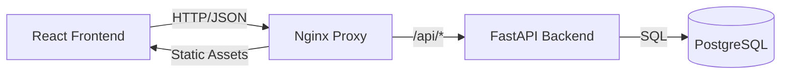

# SecureGen - Secure Credential Manager

**SecureGen** is a full-stack web application designed to generate, manage, and store secure credentials (usernames and passwords). It features a responsive React frontend, a robust Python FastAPI backend, and a PostgreSQL database, fully containerized with Docker.

---

## 📚 User Manual

### 1. Quick Start

#### Default Login
For demonstration and development purposes, the system comes with a pre-configured admin account:
*   **Username**: `admin`
*   **Password**: `admin`

#### Registration
You can also create your own isolated vault by clicking **"Sign Up"** on the login screen. Each user has access only to their own history.

### 2. Features Guide

#### 🔐 Credential Generator
Navigate to the **Generator** tab to create NIST-compliant credentials:
*   **Username Modes**:
    *   *Manual*: Type a specific username.
    *   *Pattern*: Use templates like `{adjective}{noun}###` (e.g., `SilentFox123`) or predefined presets (Email, Service Account).
*   **Password Rules**: Adjust length (4-64 chars) and toggle Uppercase, Numbers, and Symbols.
*   **Metadata**: Add optional **Remarks** (notes) and **Groups** (categories) for organization.
*   **Strength Meter**: Real-time visual feedback on password entropy.

#### 📜 History Management
Navigate to the **History** tab to manage your vault:
*   **Views**: Toggle between **List View** and **Grouped View** (categorized by Group).
*   **Search & Filter**:
    *   Real-time search by username or remark.
    *   **Advanced Filters**: Filter by specific Date Ranges (presets available) or Groups.
*   **Actions**:
    *   **Copy**: One-click copy for passwords and usernames.
    *   **Edit**: Modify remarks or groups for existing records.
    *   **Bulk Actions**: Select multiple records to batch update their Group.
    *   **Export**: Download your current view as a **CSV file**.

---

## 🛠 Installation & Deployment

### Prerequisites
*   [Docker](https://www.docker.com/) and Docker Compose installed.

### Deployment Steps

1.  **Configure Backend Mode**:
    Open `services/api.ts` and ensure the application is set to use the real backend:
    ```typescript
    const USE_MOCK_BACKEND = false; 
    ```

2.  **Run with Docker Compose**:
    In the project root directory, run:
    ```bash
    docker-compose up --build
    ```

3.  **Access**:
    Open your browser and visit: `http://localhost:3000`

### Local Development (Frontend Only)
To preview the UI without the backend (using Mock Data in LocalStorage):
1.  Set `USE_MOCK_BACKEND = true` in `services/api.ts`.
2.  Run `npm install` and `npm run dev`.

---

## 📐 Technical Design Document

### 1. System Architecture

SecureGen follows a standard containerized microservices architecture.



### 2. Technology Stack

*   **Frontend**: 
    *   **React 19** (UI Library)
    *   **TypeScript** (Type Safety)
    *   **Tailwind CSS** (Styling)
    *   **Vite** (Build Tool)
*   **Backend**:
    *   **Python FastAPI** (High-performance Web Framework)
    *   **SQLAlchemy** (ORM)
    *   **Pydantic** (Data Validation)
    *   **Passlib[bcrypt]** (Password Hashing)
    *   **Python-Jose** (JWT Token handling)
*   **Database**: PostgreSQL 15
*   **Infrastructure**: Docker & Docker Compose

### 3. Database Schema

The system uses two main tables to ensure data isolation and integrity.

#### `users` Table
| Column | Type | Description |
| :--- | :--- | :--- |
| `id` | UUID | Primary Key |
| `username` | String | Unique Login ID |
| `hashed_password` | String | Bcrypt Hash |

#### `credentials` Table
| Column | Type | Description |
| :--- | :--- | :--- |
| `id` | UUID | Primary Key |
| `user_id` | UUID | Foreign Key (Links to `users.id`) |
| `username` | String | Generated Username |
| `password_plain` | String | Plaintext storage (Feature Requirement*) |
| `created_at` | DateTime | Timestamp |
| `group` | String | Optional Category |
| `remark` | String | Optional Notes |

*> **Security Note**: Plaintext passwords are stored to fulfill the specific requirement of a "History View" where users can retrieve previously generated passwords. In a strict authentication provider scenario, this field would be omitted or encrypted via a user-held key.*

### 4. API Specification

All API endpoints are prefixed with `/api` and require `Authorization: Bearer <token>` header (except auth endpoints).

| Method | Endpoint | Description |
| :--- | :--- | :--- |
| `POST` | `/auth/register` | Register a new user |
| `POST` | `/auth/token` | Login (Returns JWT) |
| `POST` | `/generate` | Generate and save a credential |
| `GET` | `/records` | Fetch history for current user |
| `PATCH` | `/records/{id}` | Update a specific record |
| `POST` | `/records/batch-update` | Update multiple records |
| `POST` | `/records/batch-delete` | Delete multiple records |

### 5. Project Structure

```
.
├── backend/                # Python FastAPI Backend
│   ├── main.py             # Application Entry & Logic
│   ├── Dockerfile
│   └── requirements.txt
├── components/             # React Components
│   ├── AuthPage.tsx        # Login/Register UI
│   ├── HistoryTable.tsx    # Data Grid & Filtering
│   └── PasswordGenerator.tsx # Generator Logic
├── services/
│   └── api.ts              # API Client (Mock & Real modes)
├── types.ts                # TypeScript Interfaces
├── App.tsx                 # Main React Component
├── Dockerfile              # Frontend Dockerfile
├── docker-compose.yml      # Orchestration
└── nginx.conf              # Nginx Proxy Config
```
